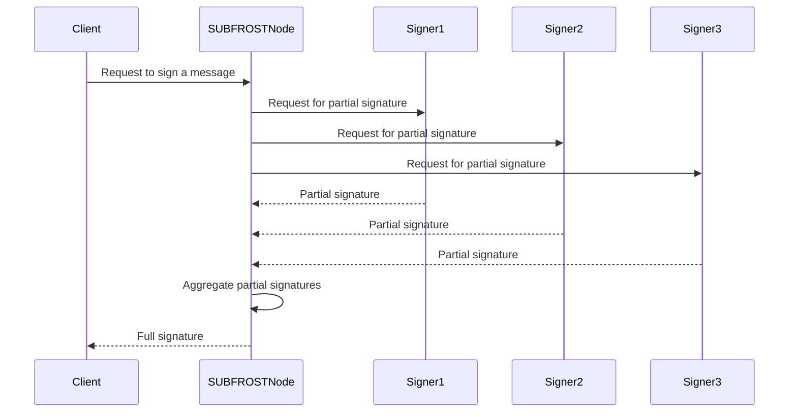

# FROST & ROAST Cryptography for Signing

**FROST (Flexible Round-Optimized Schnorr Threshold)** and **ROAST (Robust Asynchronous Schnorr Threshold)** signatures are the cryptographic cornerstones of the SUBFROST protocol. They are threshold signature schemes that allow a large, dynamic set of signers to collectively create a single Schnorr signature without any single signer ever possessing the full private key.

SUBFROST uses the `frost-core` and `frost-secp256k1-tr` crates for its implementation of FROST and ROAST.

## How it Secures the Peg

The 1:1 peg between Bitcoin and `frBTC` is maintained by a large pool of signers. The BTC that collateralizes `frBTC` is held in a single Bitcoin address whose private key is managed by the entire signer set using the FROST protocol. Please read **here** to understand our two-phased approach to the signing group.

### Distributed Key Generation (DKG)

Before the signing group can start creating signatures, they must first perform a **Distributed Key Generation (DKG)** ceremony. This is an interactive protocol where the participants collaboratively generate a single group public key, while each participant only holds a secret share of the corresponding private key.

The DKG process ensures that the full private key is never constructed or held by any single participant, or even by a colluding subset of participants (as long as the threshold is not reached). This is a fundamental security property of the SUBFROST protocol.

### Signing with FROST & ROAST

To spend the BTC held in the multisig address (i.e., to process an `frBTC` unwrap request), a threshold `t` of the total `n` signers must cooperate to create a signature.

The signing process is optimized to be highly efficient and to minimize the number of communication rounds required. This is where ROAST comes in. ROAST is an optimization of FROST that allows for a non-interactive signing session, assuming a single round of pre-computation has already been performed.

The signing process can be broken down into two phases:

1.  **Pre-computation (Nonce Generation):** In this phase, each participant generates a set of public/private nonce pairs. The public nonces are then shared with the other participants. This phase can be done ahead of time, before a signature is actually needed.

2.  **Signing (Online Phase):** When a signature is needed for a specific message (e.g., a Bitcoin transaction), each participant uses their secret share, the message, and one of their pre-computed nonces to create a **partial signature**. These partial signatures are then sent to a coordinator (which can be any of the participants) who aggregates them into a single, valid Schnorr signature.

This two-phase process makes the online signing phase extremely fast and efficient, as it only requires a single round of communication.

## Key Advantages

-   **No Single Point of Failure:** The full private key never exists in one place, making it impossible for a single compromised signer (or a minority group) to steal the funds.
-   **Scalability:** The protocol supports a large and dynamic set of signers. New signers can join and old ones can leave through a process called a "reshare" ceremony.
-   **Efficiency:** ROAST's asyncornous design makes the signing process fast and efficient, which is crucial for a high-performance system like SUBFROST.
-   **Flexibility:** FROST' is a flexible protocol that can be adapted to a variety of use cases, such as multisig wallets and their usage in complex decentralized applications like SUBFROST.

This trust-minimized setup is a significant improvement over traditional federated or centralized peg mechanisms, providing a far higher degree of security and decentralization for the assets, such as BTC, locked on the SUBFROST protocol.

## The SUBFROST Implementation

SUBFROST's implementation of FROST and ROAST is built on top of the `frost-core` and `frost-secp256k1-tr` crates. The `subfrost-core` crate provides the core logic for the SUBFROST protocol, and it uses these crates to implement the FROST and ROAST signing protocols.

The `SUBFROSTEngine` is the main orchestrator of the signing process. It is responsible for:

*   **Managing the signer set:** The `SUBFROSTEngine` keeps track of the current set of signers and their public keys.
*   **Coordinating the DKG ceremony:** The `SUBFROSTEngine` initiates and coordinates the DKG ceremony when a new signer set is formed.
*   **Coordinating the signing process:** The `SUBFROSTEngine` coordinates the FROST and ROAST signing process when a new signature is required.

The signing process is illustrated in the following diagram:



### The `SUBFROSTEngine`

The `SUBFROSTEngine` is the heart of the SUBFROST node. It is a generic struct that is parameterized by a `MetashrewProvider` and a `SUBFROSTWasmRunner`. This design allows the `SUBFROSTEngine` to be highly modular and testable.

The `MetashrewProvider` trait provides an abstraction for the connection to a metashrew index. This allows the `SUBFROSTEngine` to be used with a live JSON-RPC endpoint in production and a direct in-memory adapter during tests.

The `SUBFROSTWasmRunner` trait provides an abstraction for the execution of the consensus WASM. This allows for a real wasmtime-based runtime and a mock runtime.

The `SUBFROSTEngine` implements the `SUBFROSTApiProvider` trait, which defines the `subfrost_getbundle` function. This is the primary entry point for clients who want to get a bundle of assets.

Here is an example of how to instantiate and use the `SUBFROSTEngine`:

```rust
use subfrost_core::engine::SUBFROSTEngine;
use subfrost_core::traits::{MetashrewProvider, SUBFROSTWasmRunner};
use std::sync::Arc;

// Create a mock MetashrewProvider and SUBFROSTWasmRunner
let metashrew_provider = Arc::new(MockMetashrewProvider::new());
let wasm_runner = Arc::new(MockSUBFROSTWasmRunner::new());

// Create a new SUBFROSTEngine
let engine = SUBFROSTEngine::new(metashrew_provider, wasm_runner);

// Call the subfrost_getbundle function
let result = engine.subfrost_getbundle("".to_string()).await;
```
