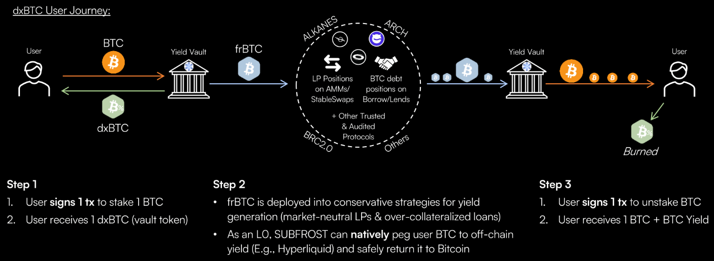

# `dxBTC` Overview
## Yield-bearing BTC of Bitcoin L1

`dxBTC` is a yield-generating synthetic Bitcoin asset built on top of the SUBFROST ecosystem. It is designed to provide Bitcoin holders with a way to earn a sustainable yield on their assets in a trust-minimized and decentralized manner.

In practice, this is the simplest possible way for a user to earn BTC yield with their BTC:

1. User signs a **single** Bitcoin transaction to stake their native **BTC** in the SUBFROST yield vault. The user receives `dxBTC`, which represents their staked BTC.
2. Their BTC is wrapped to `frBTC` and deployed into market-neutral LP strategies and over-collateralized lending protocols across Bitcoin L1, earning yield regardless of BTC price movement.
3. This yield is then passed back to stakers in the form of native **BTC**, which the user can check at any time.
4. User signs a **single** Bitcoin transaction to unstake their native **BTC** and burn their `dxBTC`.

These yield vaults will be deployed across Alkanes, Arch, BRC 2.0, and any other programmable ecosystem that launches on Bitcoin mainnet.

This economic model is **already proven** on other blockchains like Ethereum and Solana and can be *dramatically simplified* for the end user.

## How does it work? `frBTC` + Yield

At its core, `dxBTC` is an alkane that locks up `frBTC`. SUBFROST governance then acts as a decentralized strategist, deploying the locked `frBTC` into various conservative yield-generating strategies.

These strategies can include:

*   **Providing liquidity to decentralized exchanges:** The `frBTC` can be used to provide liquidity to delta-neutral LPs like `frBTC`/`wBTC` or other trading pairs on decentralized exchanges, earning trading fees.
*   **Lending:** The `frBTC` can be lent out on decentralized, over-collateralized lending platforms to earn interest.
*   **Cross-chain Strategies:** The `frBTC` can be trustlessly bridged to other blockchain ecosystems, like Hyperliquid, to participate in yield farming opportunities.

The profits generated from these strategies are then distributed back to the `dxBTC` holders, allowing them to earn a passive income while maintaining full exposure to their BTC. This provides a way for Bitcoin holders to put their assets to work without having to sell them or trust a centralized custodian.

## The Role of SUBFROST Governance

[**SUBFROST governance**](/key-components/proof-of-stake) plays a crucial role in `dxBTC`. The governance is responsible for:

*   **Selecting and managing yield-generating strategies:** The governance researches, vets, and selects the most promising and secure yield-generating strategies for the locked `frBTC`.
*   **Monitoring and rebalancing:** The governance continuously monitors the performance of the selected strategies and rebalances the portfolio as needed to optimize yield and manage risk.
*   **Distributing profits:** The governance ensures that the profits generated from the yield-generating strategies are distributed fairly to all `dxBTC` holders.

By combining the security and decentralization of SUBFROST with the yield-generating potential of DeFi, `dxBTC` provides a powerful new tool for Bitcoin holders to grow their wealth.