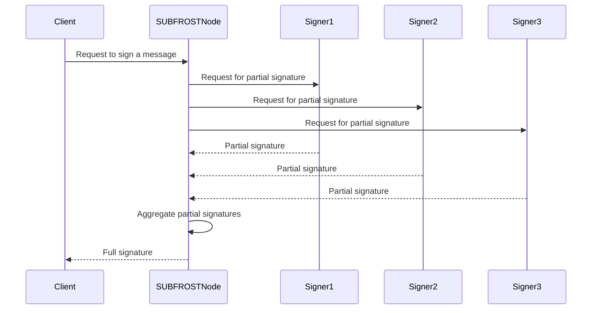

# FROST & ROAST 签名密码学

**灵活轮次优化的 Schnorr 门限签名（FROST）**和**鲁棒异步 Schnorr 门限签名（ROAST）**是 SUBFROST 协议的密码学基石。它们是门限签名方案，允许一组大型、动态的签名者集体创建单个 Schnorr 签名，而无需任何单个签名者持有完整的私钥。

SUBFROST 使用 `frost-core` 和 `frost-secp256k1-tr` crate 来实现 FROST 和 ROAST。

## 如何保护锚定机制

Bitcoin 与 `frBTC` 之间的 1:1 锚定由大量签名者组成的池来维护。用于抵押 `frBTC` 的 BTC 存放在一个单一的 Bitcoin 地址中，其私钥由整个签名者集合通过 FROST 协议管理。请阅读[**此处**](/tokens/frBTC-roadmap)了解我们签名组的两阶段方案。

### 分布式密钥生成（DKG）

在签名组开始创建签名之前，必须首先执行一个**分布式密钥生成（DKG）**仪式。这是一个交互式协议，参与者协作生成一个单一的群组公钥，而每个参与者只持有对应私钥的一个秘密份额。

DKG 过程确保完整的私钥永远不会被任何单个参与者构建或持有，甚至不会被串通的参与者子集获得（只要未达到门限数量）。这是 SUBFROST 协议的基本安全属性。

### 使用 FROST & ROAST 签名

要花费多签地址中持有的 BTC（即处理 `frBTC` 解包装请求），总共 `n` 个签名者中的 `t` 个门限签名者必须合作创建签名。

签名过程经过优化，具有高效率并最大限度地减少所需的通信轮次。这就是 ROAST 的作用。ROAST 是 FROST 的优化版本，假设已完成一轮预计算，即可实现非交互式签名会话。

签名过程可分为两个阶段：

1.  **预计算（Nonce 生成）：** 在此阶段，每个参与者生成一组公共/私有 nonce 对。然后将公共 nonce 与其他参与者共享。此阶段可以提前完成，在实际需要签名之前进行。

2.  **签名（在线阶段）：** 当需要对特定消息（例如 Bitcoin 交易）进行签名时，每个参与者使用其秘密份额、消息和一个预计算的 nonce 来创建**部分签名**。这些部分签名随后发送给协调者（可以是任何参与者），由协调者将它们聚合成一个完整的、有效的 Schnorr 签名。

这种两阶段流程使在线签名阶段极其快速和高效，因为它只需要一轮通信。

## 关键优势

-   **无单点故障：** 完整的私钥永远不会存在于一个地方，使得单个被入侵的签名者（或少数群体）不可能窃取资金。
-   **可扩展性：** 该协议支持大型且动态的签名者集合。新签名者可以加入，旧签名者可以通过称为"重新分享"的仪式离开。
-   **高效性：** ROAST 的异步设计使签名过程快速高效，这对于 SUBFROST 这样的高性能系统至关重要。
-   **灵活性：** FROST 是一个灵活的协议，可以适应各种用例，如多签钱包及其在 SUBFROST 等复杂去中心化应用中的使用。

这种信任最小化的设置相比传统的联邦制或中心化锚定机制是一个重大改进，为锁定在 SUBFROST 协议上的资产（如 BTC）提供了更高程度的安全性和去中心化。

## SUBFROST 的实现

SUBFROST 的 FROST 和 ROAST 实现建立在 `frost-core` 和 `frost-secp256k1-tr` crate 之上。`subfrost-core` crate 提供了 SUBFROST 协议的核心逻辑，并使用这些 crate 来实现 FROST 和 ROAST 签名协议。

`SUBFROSTEngine` 是签名过程的主要编排器。它负责：

*   **管理签名者集合：** `SUBFROSTEngine` 跟踪当前的签名者集合及其公钥。
*   **协调 DKG 仪式：** `SUBFROSTEngine` 在新签名者集合形成时发起和协调 DKG 仪式。
*   **协调签名过程：** `SUBFROSTEngine` 在需要新签名时协调 FROST 和 ROAST 签名过程。

签名过程如下图所示：



### `SUBFROSTEngine`

`SUBFROSTEngine` 是 SUBFROST 节点的核心。它是一个泛型结构体，以 `MetashrewProvider` 和 `SUBFROSTWasmRunner` 作为参数。这种设计使 `SUBFROSTEngine` 具有高度的模块化和可测试性。

`MetashrewProvider` trait 提供了与 metashrew 索引连接的抽象。这使得 `SUBFROSTEngine` 可以在生产环境中使用实时 JSON-RPC 端点，在测试中使用直接的内存适配器。

`SUBFROSTWasmRunner` trait 提供了共识 WASM 执行的抽象。这允许使用基于 wasmtime 的真实运行时和模拟运行时。

`SUBFROSTEngine` 实现了 `SUBFROSTApiProvider` trait，该 trait 定义了 `subfrost_getbundle` 函数。这是客户端获取资产包的主要入口点。

以下是如何实例化和使用 `SUBFROSTEngine` 的示例：

```rust
use subfrost_core::engine::SUBFROSTEngine;
use subfrost_core::traits::{MetashrewProvider, SUBFROSTWasmRunner};
use std::sync::Arc;

// Create a mock MetashrewProvider and SUBFROSTWasmRunner
let metashrew_provider = Arc::new(MockMetashrewProvider::new());
let wasm_runner = Arc::new(MockSUBFROSTWasmRunner::new());

// Create a new SUBFROSTEngine
let engine = SUBFROSTEngine::new(metashrew_provider, wasm_runner);

// Call the subfrost_getbundle function
let result = engine.subfrost_getbundle("".to_string()).await;
```
