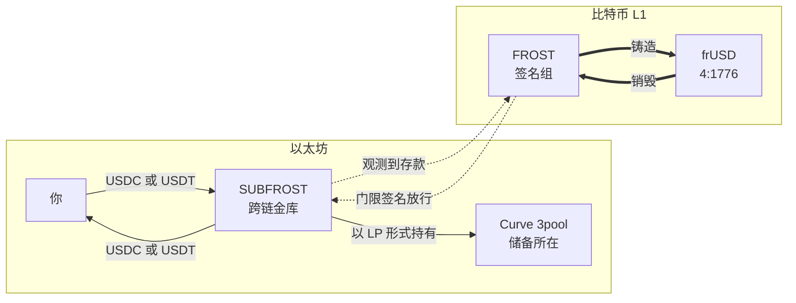
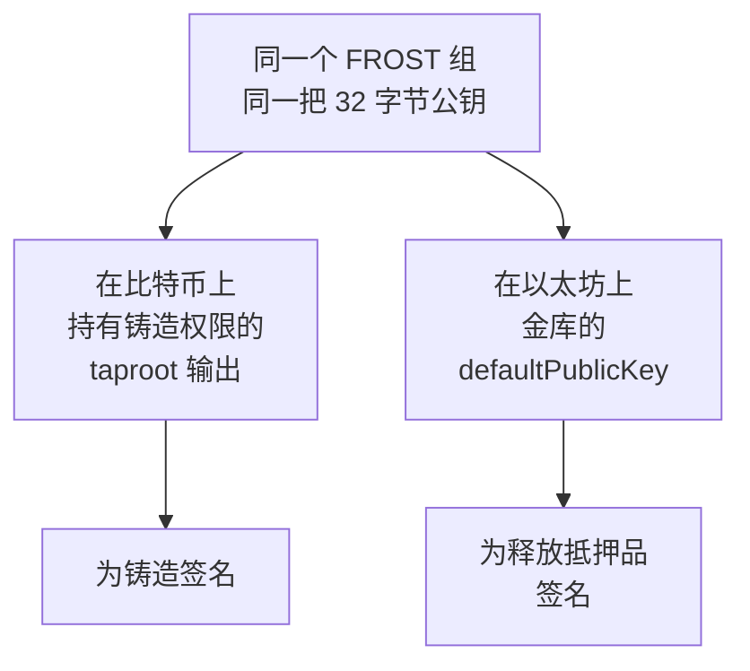

import Admonition from '@theme/Admonition';

# frUSD 概览
## 结算在比特币 L1 上的美元

`frUSD` 是一种以 [Alkanes](../protocol/alkanes) 资产形式存在于比特币 L1 上的美元代币。它持有普通的比特币 UTXO，通过普通的比特币交易转移，并且可以像其他任何 Alkanes 代币一样被组合进合约调用。这正是它与那些仅仅「引用」比特币、却运行在其他链上的美元代币的区别所在。

它已在主网上线，alkane id 为 `4:1776`，**8 位小数**。

frUSD 的意义在于一个由工作量证明清算的 BTC/USD 市场。世界上实际在用的那些美元都结算在别处，并要求比特币等待；而 frUSD 就在比特币所在的地方结算。

## 美元存放在哪里

frUSD 是**完全储备的，而非算法稳定币**。没有需要盯着的链上抵押率，没有清算引擎，也没有铸币税。每一枚 frUSD 之所以存在，都是因为有人在以太坊上存入了以美元计价的稳定币：

1. 用户将 **USDC 或 USDT** 存入以太坊上的 SUBFROST 跨链金库。
2. SUBFROST 签名组观测到该笔存款后，在比特币上铸造相应数量的 `frUSD`，发送到存款时指定的比特币地址。
3. 在比特币上销毁 `frUSD` 则是反向指令：它会在以太坊一侧释放相应价值。

把两条粗箭头读作一次往返。其余部分是这段价值在两次操作之间停放的地方。

以 USDC 和 USDT 作为锚定是一个刻意的选择，而不是权宜之计。在链上，标准的美元其实早已确定：USDC 和 USDT 就是市场用来报价、并当作现金看待的资产。frUSD 并不试图取代它们，而是锚定它们，因此其锚定价格跟踪的是整个生态已经达成共识的美元，而不是一种合成的近似物。SUBFROST 改变的不是美元本身，而是你持有和转移它所在的那一层。

存入的稳定币不会闲置。金库的策略合约会把它们存入 [Curve 3pool](https://curve.fi/)，因此支撑 frUSD 的储备是以 3pool LP 的形式持有，而非原始的 USDC 和 USDT。更换该策略需要与转移抵押品本身相同的门限签名。

这个结构的作用不只是赚取收益。Curve 的 LP 代币没有发行方，因此也没有冻结某个余额的函数：稳定币发行方无论拥有何种权限，都无法对一份资金池份额行使这些权限。

<Admonition type="warning" title="明确说明信任模型">

frUSD 的风险状况与 `frBTC` 并不相同，两者不应被视为具有同等程度的信任最小化。区别不在于谁持有密钥，而在于抵押品存放在哪里。

储备位于以太坊上的 SUBFROST 跨链金库中。该金库没有所有者密钥：转出抵押品、更换策略和提取手续费，都只能通过一笔携带 BIP-340 签名的调用来完成，而该签名来自为 frUSD 比特币一侧签名的同一个 [FROST](../key-components/frost-and-roast) 门限组。该门限组是 frUSD 自己的；`frBTC` 由另一个联盟签名。

同样的 32 字节，在一条链上是见证程序，在另一条链上是被授权的公钥。两者之间没有任何映射关系，也没有第二把可以被攻破的密钥；这正是两侧无法彼此脱节的原因，也是扩大该组规模只是一次密钥轮换、而非一次迁移的原因。

这并不能消除以下几点：

- **抵押品不在比特币上。** 它承担 `frBTC` 所没有的以太坊风险、Curve 风险和稳定币发行方风险。
- **合约可升级，且未经审计。** 跨链金库和 `4:1776` 代币都位于可升级代理之后，并且这一切都尚未经过正式的安全审计。代币一侧还保留着自己的所有者，即一枚设置销毁下限等参数的权限代币；这是与金库不同之处，而非金库的形态。
- **门限是密码学，还不等于联盟。** 门限能为你提供多少保护，取决于那些密钥份额实际存放在哪里，而这是一个运营层面的事实，无法从链上读出。
- **铸造与赎回运行在 SUBFROST 的基础设施上。** 跨链桥会在边界处针对制裁名单筛查存款，并对照稳定币发行方自己的黑名单检查出款地址。赎回还需要等待签名组行动，且没有时间上限，而提交其调用的唯一途径是一组由单个管理员地址管理的 relayer。至于在比特币上持有和转移 frUSD 本身，则不受上述任何筛查，也没有冻结功能。

请在了解上述全部内容的前提下使用。

</Admonition>

## 我要如何获得 frUSD？

### 1. 在 frUSD/frBTC 资金池中交换

最直接的路径，也是全程不离开比特币的路径。`frUSD` 在 `4:1778` 的 [CryptoSwap 资金池](../using-subfrost/pools-liquidity)中与 `frBTC` 交易，因此以 BTC 计价的价值可以在不触及其他链的情况下换成美元，并换回来。

### 2. 通过从以太坊跨链存入 USDC 或 USDT 来铸造

你在以太坊上存款，`frUSD` 会被铸造到你指定的比特币地址。金库会先收取一笔固定费用，再按剩余部分收取一定比例，目前是 **1.99 美元加 0.10%**，两者都从链上读取而非硬编码。**销毁换回同样要支付这笔固定费用和同样比例的费用**，因此接近下限的销毁，收到的金额会明显少于销毁掉的金额。

该下限为 **10 frUSD**：低于该值，销毁会直接回滚，而不是少付给你。它是代币的默认值而非常量，持有其权限代币的一方可以更改，并且可以从链上读取。

在应用中，选择 USDC 或 USDT 作为你支付的资产，选择 `frUSD` 作为你收到的资产。你会被要求连接一个以太坊钱包并签署两笔交易：一笔是针对你所存入金额的授权（approve），另一笔是存款本身。

如果你更愿意自己操作，[BTC/USD 命令](../api-reference/cli-sdk/btcusd)会打印出同样的两个调用，供你在自己的钱包中签名。

:::danger[向金库发送普通转账不等于存款]
存款必须通过跨链合约自身的存款调用完成，该调用携带了指明你比特币地址的指令。**以普通代币转账的方式向金库地址发送 USDC 或 USDT 不会铸造任何东西**：它到达时不附带任何指令，并且没有自动的退回路径。
:::

### 3. 接收它

`frUSD` 是一种普通的 Alkanes 代币。任何支持 Alkanes 资产的钱包都可以持有、发送和接收它，它会与你的其他余额一同显示。

## 目前有哪些功能已经上线

说清楚状态很重要，以下是各个部分的现状。

| | 状态 |
|---|---|
| 比特币主网上的 `frUSD` 代币（`4:1776`） | **已上线** |
| 通过从以太坊跨链存入 USDC/USDT 进行铸造 | **已上线**。命令行会为你准备好那两笔以太坊调用，供你在自己的钱包中签名 |
| 将 frUSD 销毁并换回以太坊资产 | **已上线** |
| 存入时将一部分拆分为 BTC | **已上线**。网络无法执行的拆分会改为支付普通 frUSD，使用前请阅读 [BTC/USD 命令](../api-reference/cli-sdk/btcusd)中的说明 |

## 接下来去哪里

- [Swap（交换）](../using-subfrost/swap)：通过 frUSD/frBTC 资金池进行 BTC 与 USD 之间的交易。
- [Pools & Liquidity（资金池与流动性）](../using-subfrost/pools-liquidity)：向该资金池提供流动性能获得什么，以及它的手续费与标准 AMM 资金池有何不同。
- [BTC/USD Commands（BTC/USD 命令）](../api-reference/cli-sdk/btcusd)：从命令行读取资金池数据、获取报价，或准备一笔跨链存入交易。
- [frBTC 概览](./frBTC-overview)：frUSD 与之交易的包装 BTC 资产，以及两者托管模型的差异所在。
- [Every Stablecoin Has an Off-Switch. frUSD Doesn't.（每一种稳定币都有关闭开关，frUSD 没有）](https://subfrost.io/articles/frusd-off-switch-free-finance)：阐述「为什么值得构建一种结算在 Bitcoin 上的美元」的文章。它论述的是目标；本页记录的是今天已经建成的部分。
